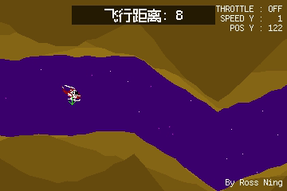

# Helicopter Reinforcement Learning

This project trains a PPO agent to pilot a retro helicopter game using Stable-Baselines3 and a custom Gymnasium environment.



- Pixel-art helicopter game with tunnel generation and dynamic obstacles.
- Gymnasium-compatible `HelicopterEnv` environment supporting human and RGB renders.
- PPO training pipeline with checkpointing, TensorBoard logging, and vectorized environments.
- Evaluation script with optional gameplay video export via FFmpeg.

## Getting Started

### Prerequisites

- Python 3.11+
- [FFmpeg](https://ffmpeg.org/) (optional, required for video export)

### Installation

```bash
python -m venv .venv
source .venv/bin/activate
pip install -r requirements.txt
```

## Training

```bash
python train.py --n-envs 32 --total-timesteps 5000000 --save-freq 5000
```

- `--n-envs`: Number of parallel environments (default: 100).
- `--total-timesteps`: Total training timesteps (default: 100,000,000).
- `--save-freq`: Checkpoint frequency in steps (default: 1000).

Checkpoints, replay buffers, and TensorBoard logs are written to `tmp/`.

## Evaluation

```bash
python eval.py --model tmp/rl_model_500000_steps.zip --out-video gameplay.mp4
```

If `--model` is omitted, the latest checkpoint in `tmp/` is used. Omit `--out-video` for a live-rendered evaluation window.

## Play Manually

```bash
python helicopter_game.py
```

Controls: hold `SPACE` to thrust upward, release to fall. Press `R` or `SPACE` after a crash to restart, `ESC` to quit.

## Project Structure

- `helicopter_game.py`: Pygame implementation of the helicopter game.
- `helicopter_env.py`: Gymnasium environment wrapper.
- `train.py`: PPO training entry point with checkpointing.
- `eval.py`: Model evaluation and video capture script.
- `assets/`: Sprite sheets and fonts used by the game.
